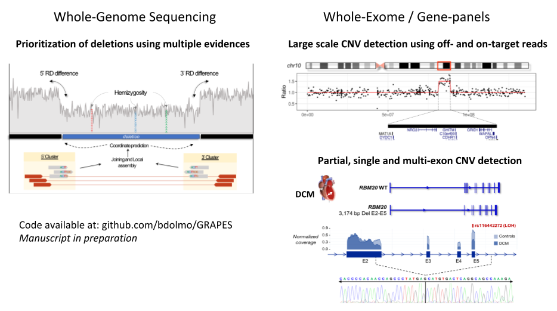

# What is GRAPES?
 GRAPES is a commnand-line tool capable to detect Germline SVs on whole-genome or targeted enrichment sequencing samples.

#### What's new in GRAPES 0.9.3 ? 12-09-2019
* Several bug fixes.
* Implementation of a local assembly engine based on bi-directional k-mer extension and consensus calling, inspired by SSAKE/VCAKE.
* Hemizygous SNV calling through MD-tag parsing to prioritize deletions.
* Now, on WGS contigs are mapped genome-wide whereas on TS contigs are mapped locally.
* Added z-score and MAD calculation for CNV calls.
* New command "reference" to summarize and compress highly correlated samples for targeted sequencing.

## Features
* Germline SV calling on WGS through integration of Discordant, split-read, read-depth and local assembly.
* Adopts CNV calling trough Reference Coverage Profiles ([RCP](https://doi.org/10.3389/fgene.2015.00045)) to mimic population-based CNV calling.
* Prioritization of CNVs using local read-depth and LOH information (especially applies on deletions).
* SV/CNV calling on exome and targeted gene panels combining information from breakpoint-, on- and off-target reads.
* Clustering of samples with highly correlated read depth for improved CNV calling specificity.
* Partial-exon, single-exon and multiple exon CNV detection.
* SV annotation using gnomAD v2.
 


 For questions, bugs, comments etc. feel free to contact me: bdelolmo@gencardio.com

## Installation

### Docker installation
 There is an official docker repository to use GRAPES without the need to install several dependencies.
```
docker pull bdolmo/grapes
```
And run commands with:
```
docker run -it bdolmo/grapes:latest GRAPES
```

### Source installation

 GRAPES will only work on Unix-based systems. Works only for human genomes.
 Before building and installing GRAPES, make sure you have available on path:
* Perl
* R (>= 3.3). In addition Rscript must be accessible
* g++ compiler (>= 4.7)
* Boost C++ library
* openMP C++ API
* [BEDtools](https://github.com/arq5x/bedtools2)
* [SAMtools](http://www.htslib.org/)
* [Tabix](https://github.com/samtools/tabix)
* [macs2](https://github.com/taoliu/MACS)
* GNU core utils:  wget, awk, sort, cat, grep, head, tail, sed, cut, paste, uniq, wc and mv.
  macOS users: need to install Homebrew (https://brew.sh/) and the latest XCode.

#### Perl modules
* Parallel::ForkManager
* Sort::Key::Natural
* Statistics::Descriptive
* PDF::API2 (Optional)
* PDF::Table (Optional)

You can install them through CPAN:
```
cpan Parallel::ForkManager Sort::Key::Natural Statistics::Descriptive PDF::API2 PDF::Table
```
Then you can download and install the latest release:
```
 git clone --recursive https://github.com/bdolmo/GRAPES.git
 cd GRAPES
 ./INSTALL.PL
```
INSTALL.PL will compile all C++ code along with the required R packages for segmentation and plotting.
In addition it will download both 75-mer and 100-mer mappability tracks for GRCh37 and GRCh38 and gnomaAD annotation files.

#### BAM preferences

* BAM aligned with BWA-MEM or Bowtie2. Other mappers that apply local alignment (e.g CUSHAW3, Novoalign) are also convenient.
* Sorted by genomic position.
* Without Adapters and PCR duplicates (Optional but very recommended).

## Commands:

* GRAPES wgs - Call SVs on WGS.
* GRAPES wes - Call SVs on WES/gene panels.
* GRAPES reference - Create reference coverage profiles from highly correlated samples.
* GRAPES annotate - Annotated BED files with gnomAD b37 SV dataset.

### GRAPES wgs
```
./GRAPES wgs -bam <BAM_FILE> -g <GENOME_FASTA> -o <OUTPUT_DIR>
```
 Optional arguments:
 ```
-chr    STRING  Restrict analysis to an specific chromosome
-c	INT	Minimum number of Discordant pairs in a cluster [default = 5] 
-s	INT	Minimum std.dev's from the mean insert size to include discordant pairs on a cluster [default = 4] 
-r	INT	Minimum number of Break reads in a cluster [default = 5]
-m      INT     Minimum SV size [default = 50]
-t      INT 	Number of CPUs [default 1]
 ```

### GRAPES wes
```
./GRAPES wes [-pooled | -test -control] -b <BED> -g <GENOME_FASTA> -o <OUTPUT_DIR> -t <NUM_CPUs> <OPTIONS>
 ```
###### Analysis options:
```
-all	        Perform all steps below (including plots)
-breakpoint     Perform Breakpoint analysis
-extract        Extract Depth, GC and Mappability
-offtarget	Perform Off-target analysis
-build-ref      Build a reference from a pool of samples
-normalize      Normalize read depth
-callCNV        Perform Copy Ratio and segmentation
-offtarget	Trigger off-target analysis
-reportPDF      create a report in PDF (only for gene-panels)
```

###### Plotting options:
 ```
-plotLargeCNV	Plot segmented CNVs
-plotBiases	Plot read depth bias reduction before and after normalization
-plotScatter    Plot genome-wide cnv scatter plot
-plotKaryotype  Plot karyotype
 ```
###### Tuning parameters:
 ```
-minCorrelation          FLOAT	Minimum pairwise-correlation to build a reference set [default = 0.90]
-minSampleSizeCluster    INT	Default minimum number of samples to build a single baseline [default = 4]
-maxSampleSizeCluster    INT   	Default maximum number of samples to build a single baseline [default = 15]
-minZscore               FLOAT  Minimum Z-score needed to output a CNV prediction [default = 2.58]
-lowerDelCutoff          FLOAT	Lower-bound deletion cuttof ratio [default = 0.35]
-upperDelCutoff          FLOAT	Upper-bound deletion cuttof ratio [default = 0.71]
-lowerDupCutoff          FLOAT	Lower-bound duplication cuttof ratio [default = 1.25]
-minSizeSV               INT    Minimum SV size to report a breakpoint call [default = 15]
 ```

##### Example1: Pooled Analysis (creates a reference using all available samples):
 ```
./GRAPES wes -pooled BAM_DIR -all -b targets.bed -g genome.fa -o OUT_DIR -t 4
 ```    
##### Example2: Paired analysis:
```
./GRAPES wes -test test.bam -control control.bam -all -b targets.bed -g genome.fa -o OUT_DIR -t 4	
```
 
###  GRAPES reference
 ```
 GRAPES reference -i <BAM_FILE> -n <DIR_WITH_NORMALIZED_COUNTS> -o <OUTPUT_DIR> -g <GENOME_FASTA> -b <BED_FILE> -t <NUM_CPUs>
```
###### Options:
 ```
 -extract 	Extract read depth and perform normalization
 -merge		Merge all available files with corrected counts
 -plotClusters	Plot heatmap
 ```

###  GRAPES annotate
 ```
 GRAPES annotate -b <BED_FILE> -n <OUTPUT_NAME> -o <OUTPUT_DIR> -l <MIN_RECIPROCAL_OVERLAP>
 ```


