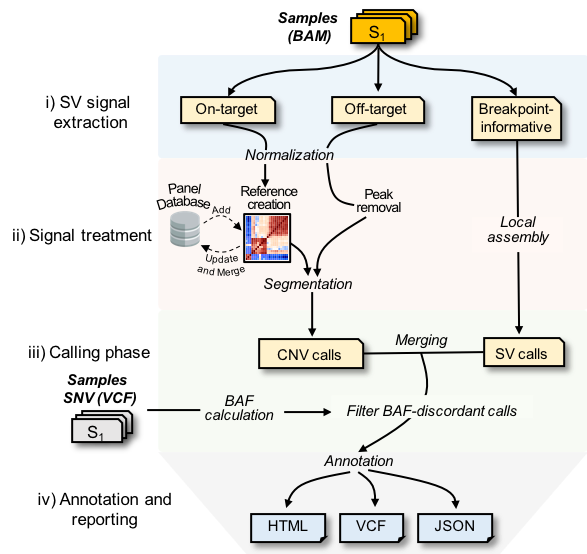

# What is GRAPES?
 GRAPES stands for "Genomic Rearrangement Analysis of Panel Enrichment Sequencing".
 It is yet another SV and CNV caller, but with new interesting features (Keep reading!)

## Features
* SV and CNV calling for targeted sequencing: using data from on-target, off-target and breakpoint-informative reads.
* Clustering of samples with highly correlated read depth for improved CNV calling specificity.
* Dynamic update of sample references using SQLite.

#### What's new in GRAPES 0.9.5 ? March-2021
* New scoring metric to evaluate the confidence of each CNV
* Improved single-exon CNV detection.
* Improved performance speed.
* BAF extraction on the fly.
* Several bug fixes.



## Installation

### Recommended Installation (Docker)
 There is a docker repository available at:
```
docker pull bdolmo/grapes
```
And run commands with:
```
docker run -it bdolmo/grapes:latest GRAPES
```

### Source installation
 GRAPES will only work on Unix-based systems and supports only human genome.
 Before building and installing GRAPES, make sure you have available on path:
* Perl
* R (>= 3.3). In addition Rscript must be accessible
* g++ compiler (>= 4.7)
* Boost C++ library
* openMP C++ API
* [BEDtools](https://github.com/arq5x/bedtools2)
* [SAMtools](http://www.htslib.org/)
* [Tabix](https://github.com/samtools/tabix)
* [macs2](https://github.com/taoliu/MACS)
* SQLite3
* GNU core utils:  wget, awk, sort, cat, grep, head, tail, sed, cut, paste, uniq, wc and mv.
  macOS users: need to install Homebrew (https://brew.sh/) and the latest XCode.

#### Perl modules
* Parallel::ForkManager
* Sort::Key::Natural
* Statistics::Descriptive
* JSON::MaybeXS;

You can install them through CPAN:
```
cpan Parallel::ForkManager Sort::Key::Natural Statistics::Descriptive JSON::MaybeXS
```
Then you can download and install the latest release:
```
 git clone --recursive https://github.com/bdolmo/GRAPES.git
 cd GRAPES
 ./INSTALL.PL
```
INSTALL.PL will compile all C++ code along with the required R packages for segmentation and plotting.
In addition it will download both 75-mer and 100-mer mappability tracks for GRCh37 and GRCh38 and gnomaAD annotation files.


## Commands
### Targeted sequencing analysis: ```GRAPES wes```
```
./GRAPES wes [-pooled | -cases -controls] -b <ROI_BED> -g <GENOME_FASTA> -o <OUTPUT_DIR> -t <nCPU> <OPTIONS>
 ```

##### Example1: Pooled Analysis (creates a reference using all available samples):
 ```
./GRAPES wes --pooled <bam_dir> --all --bed <targets.bed> --genome <genome.fa> --outdir <output_dir> --threads 4
 ```

(docker)
```
docker run -t -i \
-v $HOME/BAM_FOLDER:/bam_folder \
-v $HOME/BED_FOLDER:/bed_folder \
-v $HOME/GENOME_FOLDER:/genome_folder \
-v $HOME/OUTPUT_FOLDER:/output_folder \
-it bdolmo/grapes:latest GRAPES wes \
-all -pooled /bam_folder/ -b /bed_folder/targets.bed -g /genome_folder/genome.fa -o /out_dir/ -t 4
```

##### Example2: Case-Control analysis:
```
./GRAPES wes --cases <test.bam> --control <control.bam> --all --bed <targets.bed> --genome <genome.fa> --outdir <output_dir> --threads 4	
```

(docker)
```
docker run -t -i \
-v $HOME/CASE_FOLDER:/case_folder \
-v $HOME/CONTROL_FOLDER:/control_folder \
-v $HOME/BED_FOLDER:/bed_folder \
-v $HOME/GENOME_FOLDER:/genome_folder \
-v $HOME/OUTPUT_FOLDER:/output_folder \
-it bdolmo/grapes:latest GRAPES wes \
-all -cases /case_folder/ -controls /control_folder/ -b /bed_folder/targets.bed -g /genome_folder/genome.fa -o /out_dir/ -t 4
```

##### Required params:
```
   -o,--outdir	STRING	  Output directory
   -g,--genome	STRING    Genome reference in FASTA format
   -b,--bed	    STRING	  BED ROIs 
   -t,--threads	INT	      Number of CPUs (default = 1)
```

##### Analysis options:
```
   --all	                  Perform all steps below 
   --breakpoint             Perform Breakpoint analysis
     --nobreakpoint         Turn off breakpoint analysis
   --extract                Extract Depth, GC and Mappability
   --offtarget	            Perform Off-target analysis
     --noofftarget          Turn off offtarget analysis
   --buildref               Build a reference from a pool of samples
   --callcnv                Perform Copy Ratio and segmentation
     --nocallcnv            Turn off calling CNVs
   --normalize              Normalize read depth 
   	 options:               median (default), PCA\n
   --plotsingleexon         Plot single exon CNVs
    --noplotcnv             Turn off CNV plotting
   --plotlargecnv           Plot segmented CNVs
    --noplotcnv             Turn off CNV plotting
   --plotscatter            Plot genome-wide CNV scatter plot
   --vaf                    Include Variant-Allele Frequency (VAF) analysis
     --novaf                Turn off VAF analysis
   --samtools	              Default if --vaf set. Perform variant call with samtools
   --freebayes	            if --vaf set, perform variant call with freebayes
   --annotate	              Annotate VCF file with gnomAD v2
     --noannotate           Turn off VCF annotation
   --filtervcf	            Filter low qual VCF entries
     --nofiltervcf          Turn off VCF filtering
   --reporthtml	            Write results to an HTML file (Only for gene panels)
     --nonoplotcnv          Turn off report HTML creation
   --filterdiscordantonly	  Filter discordant-only SV predictions (default = true)
	 --nofilterdiscordantonly Turn off discordant-only filtering
   --verbose                Print sub-command messages
 ```
##### Tuning parameters:
  ```
   --mincorr            FLOAT	  Minimum pairwise-correlation to build a reference set (default = 0.91)
   --minrefsize         INT 	  Default minimum number of samples to build a single baseline (default = 2)
   --maxrefsize         INT   	Default maximum number of samples to build a single baseline (default = 15)
   --minzscore          FLOAT   Minimum Z-score required to output a CNV prediction (default = 2.58)
   --pcavariance	      FLOAT 	Variance to remove when normalizing by PCA (default = 0.7)
   --lowerdelcutoff     FLOAT	  Lower-bound deletion cutoff ratio (default = 0.35)
   --upperdelcutoff     FLOAT	  Upper-bound deletion cutoff ratio (default = 0.71)
   --lowerdupcutoff     FLOAT	  Lower-bound duplication cutoff ratio (default = 1.24)
   --minofftargetreads	INT	    Default minimum number of offtarget reads required to trigger off-target analysis (default = 1e6)
   --minofftargetsd	    FLOAT	  Default minimum number of std.dev from off-target rartios trigger off-target analysis	(default = 0.2)
   --minsvsize          INT     Minimum SV size to report a breakpoint call (default = 15)
   --maxsvsize          INT     Maximum SV size to report a breakpoint call (default = 5000000)
   --mindiscordants     INT	    Minimum number of discordant read pairs (default = 5)
   --mindiscordantssd   INT     Minimum std.deviations from the mean insert size to consider discordant pairs (default = 10)
   --breakreads         INT	    Minimum number of break reads (default = 5)
  ```

### SV annotation: ```GRAPES annotate```
 ```
 GRAPES annotate --input_vcf <VCF>  -o <OUTPUT_DIR> -l <MIN_RECIPROCAL_OVERLAP>
 ```


